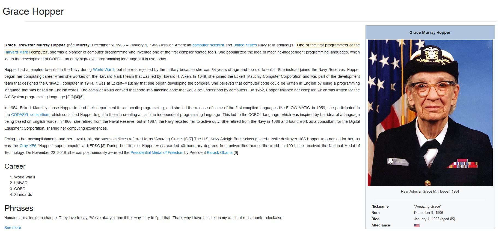

# Grace Hopper

* **Track:** _Especialización Front-end_
* **Curso:** _REACT_
* **Unidad:** _Intro a REACT y JSX_

***
## Descripción
Iniciar una aplicación con REACT que contenga 3 componentes componibles: **header**, **main** y **aside**, los que a su vez contienen otros elementos y son contenidos por App y renderizados a un div con id root en el index de la carpeta pública.

El producto final deberá verse de la siguiente forma:

## Herramientas

Para este proyecto, se usó las herramientas tecnológicas de HTML5, Bootstrap, CSS3, la librería de JS, REACT.
